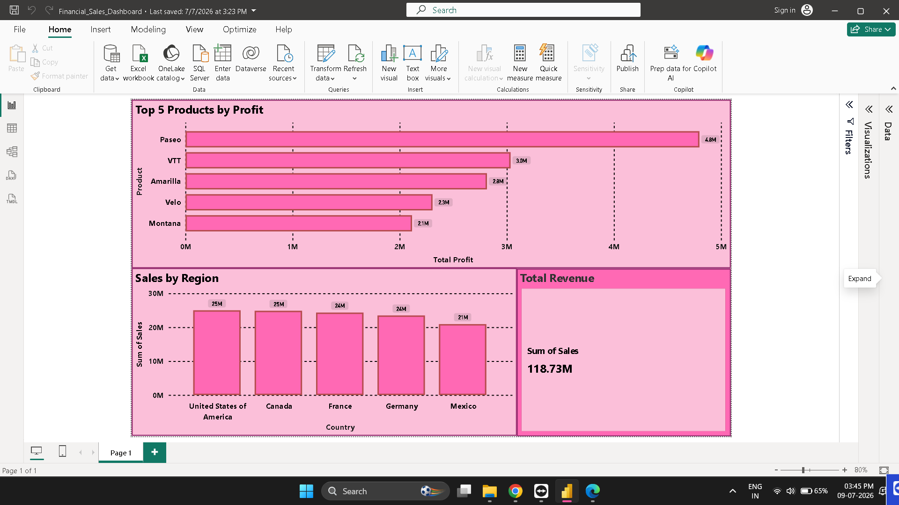

# 📊 Financial Sales Dashboard | Power BI


## 📌 Project Overview

The **Financial Sales Dashboard** is an interactive Business Intelligence solution developed using **Microsoft Power BI** to analyze financial performance across products, countries, and customer segments.

The dashboard transforms raw financial data into meaningful visual insights, enabling users to monitor sales performance, profitability, and key business metrics through an intuitive and interactive interface.

---

## 🎯 Objectives

- Analyze overall sales performance
- Monitor business profitability
- Identify top-performing products
- Compare sales across different countries
- Explore customer segment distribution
- Provide interactive filtering for better analysis

---

## 📈 Dashboard Features

### KPI Cards

- 💰 Total Revenue
- 📈 Gross Sales
- 💵 Total Profit
- 📦 Units Sold

### Visualizations

- 🌍 Sales by Country
- 🏆 Top 5 Products by Profit
- 🥧 Sales by Segment

### Interactive Filters

- 📅 Year Slicer
- 🌎 Country Slicer

---

## 🛠️ Tools & Technologies

- Microsoft Power BI Desktop
- Power Query
- DAX
- Microsoft Excel

---

## 📂 Dataset

The dashboard is built using the **Microsoft Financial Sample Dataset** containing financial records such as:

- Sales
- Gross Sales
- Profit
- COGS
- Discounts
- Country
- Product
- Segment
- Units Sold
- Date
- Year
- Month

---

## 📊 Key Insights

- Identified countries contributing the highest sales.
- Compared product profitability across the business.
- Analyzed customer segment performance.
- Enabled interactive business analysis using slicers.
- Designed an easy-to-understand dashboard for decision making.

---

## 📸 Dashboard Preview



---

## 📁 Repository Contents

```
PowerBI-Financial-Sales-Dashboard
│
├── Financial_Sales_Dashboard.pbix
├── Financial_Sales_Dashboard.pdf
├── dashboard.png
├── Dataset/
│   └── Financial_Sample.xlsx
├── README.md
└── LICENSE
```

---

## 💡 Skills Demonstrated

- Data Cleaning
- Data Transformation
- Data Modeling
- DAX
- KPI Design
- Business Intelligence
- Interactive Dashboard Design
- Data Visualization
- Analytical Thinking

---

## 🚀 Future Improvements

- Add monthly sales trend analysis
- Include forecasting
- Add drill-through reports
- Enhance KPI indicators
- Publish dashboard to Power BI Service

---

## 👩‍💻 Author

**Shagun Gupta**

Aspiring Data Analyst | Power BI | SQL | Python | Excel | Tableau

- GitHub: https://github.com/YOUR_USERNAME
- LinkedIn: https://www.linkedin.com/in/shagun-gupta14/

---

⭐ If you found this project useful, consider giving it a star!
